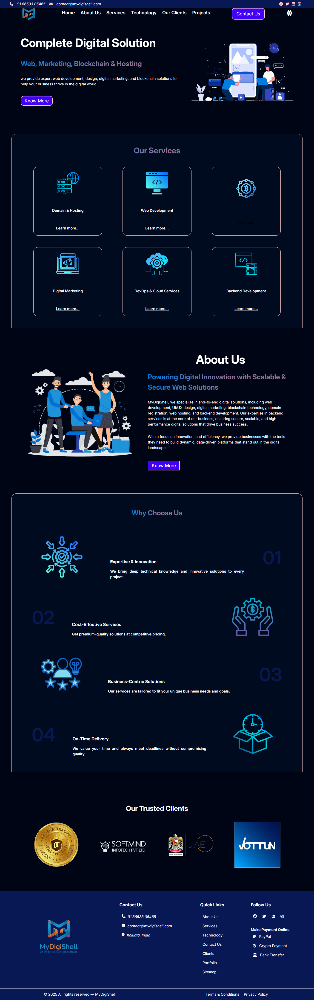

# 🌐 MyDigiShell Company Website

This is the official static website for **MyDigiShell**, a digital solutions agency offering web development, design, digital marketing, blockchain services, and more. The project is built entirely using **Vanilla HTML, CSS, and JavaScript** — without any frameworks or libraries — to demonstrate clean code, responsiveness, and core functionality implementation.

---

## 🚀 Project Overview

This website acts as a professional front face for **MyDigiShell**. It includes key sections like:

- ✅ Home
- ✅ About Us
- ✅ Services
- ✅ Technologies
- ✅ Our Clients
- ✅ Projects Showcase

---

## 🔧 Technologies Used

- **HTML5** – semantic layout and structure  
- **CSS3** – fully responsive with media queries, transitions, and variables  
- **JavaScript (ES6)** – dynamic functionality like dark/light mode toggle  
- **Font Awesome** – for icons  
- **Google Fonts** – typography  
- **Responsive Design** – mobile-first approach

---

## ✨ Features

- 🌗 **Dark/Light Mode Toggle**  
- 📱 **Fully Responsive Design** – adapts beautifully on all screen sizes  
- 🖱️ **Smooth Scroll Navigation**  
- 💡 **Animated Transitions** for theme switching and interactions  
- ⚡ **Fast Performance** – no external dependencies  
- 💼 **Professional Look & Feel** with a clean layout and good UX  
- 📁 **Organized File Structure** – easy to understand and maintain

---

## 📸 Screenshots

*(Optional – You can upload screenshots in `/screenshots` folder and reference them like below)*




---

## 📂 Folder Structure

```bash
MyDigiShell/
├── index.html
├── about.html
├── service.html
├── technology.html
├── clients.html
├── projects.html
├── css/
│   └── style.css
├── js/
│   └── script.js
├── images/
│   └── (all images here)
└── README.md
